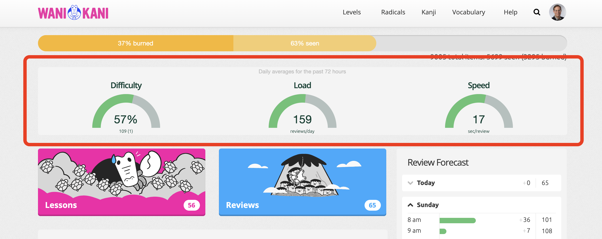

# Ganbarometer

Wanikani dashboard user script to add a "Ganbarometer."

The intent is to provide gauges for both the amount of work you're doing doing
your reviews, as well as the overall difficulty of those reviews.

Two gauges display heuristics for **Effort** and another for **Difficulty.**

**Pace** measures how many reviews you've performed over the past few days,
and how long it took you to perform those reviews.

**Difficulty** measures some key characteristics about the workload: how many
radicals or kanji are in the first two SRS stages, how many
items of any sort are in "Apprentice" stages, and the percentage of review-items
you were unable to answer correctly during your recent reviews.

By default, the script only looks at the reviews you've performed over the past
72 hours and divides by three to derive a daily average.

---

The [GanbarOmeter script](https://greasyfork.org/en/scripts/432632-ganbarometer) adds three gauges to your dashboard:

These gauges help you to decide if you should increase or decrease the number of lessons you perform each day. If the values are mostly in the middle of the ranges, you should continue at roughly the same pace. If any
