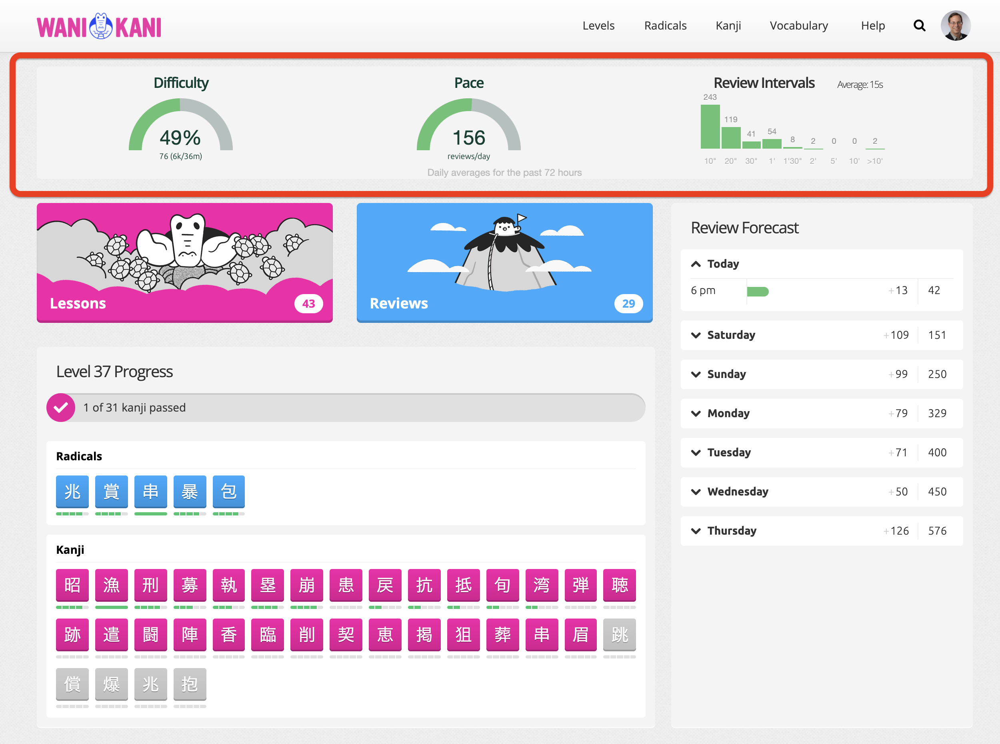

This is v2.0 of the [GanbarOmeter user
script](https://greasyfork.org/en/scripts/432632-ganbarometer).

This script adds two **gauges** and a bar chart to your dashboard. After all,
what's a _dashboard_ without gauges?



[If you like this script, you may also be interested in my [Burns
Progress](https://community.wanikani.com/t/userscript-burn-progress/53412) user
script.]

The gauges **help you decide whether to speed up or slow down doing lessons.**
If the values displayed remain in the middle of the ranges, you should continue
at roughly the same pace. If either turns yellow or red, or even peg at the
extreme right of the gauge, you might consider slowing down. Lower values mean
you might want to speed up.

The bar graph shows a pseudo-Pareto breakdown of your response time intervals
(the delays between successive reviews).

- **Difficulty** — A heuristic representing how difficult your upcoming reviews
  will likely be. It displays on a scale from 0 to 100%, where the middle of the
  scale (50%) represents "normal difficulty." Values at the higher end of the
  scale indicate that you'll likely find it hard to answer most review items
  correctly. Values higher than 80% will turn the gauge yellow. Higher than 90%
  will turn it red.

  The difficulty is mostly based on the number of Apprentice items you currently
  have under active review, but is also weighted by the percentage of reviews
  you've been answering incorrectly, as well as the number of new kanji in
  stages 1 and 2.

- **Pace** — This displays how **much** work you've been doing on average each
  day. It displays the number of reviews per day. Note that the script _averages_
  the reviews/day across all sessions for the past three days by default. By
  default, a pace of 150 reviews/day will display the gauge in the middle of its
  range.

- **Review intervals** — This displays your average time between reviews in a
  session in seconds-per-review, as well as a breakdown of the intervals within
  various ranges. By default, it displays the counts in 9 different ranges:

  - 0 to 10 seconds
  - 10 to 20 seconds
  - 20 to 30 seconds
  - 30 seconds to 1 minute
  - 1 minute to 1 minute 30 seconds
  - 1 minute 30 seconds to 2 minutes
  - 2 minutes to 5 minutes
  - 5 minutes to 10 minutes
  - greater than 10 minutes

  Note that the Wanikani API does not measure how long it takes to _answer_ a
  review item. It only tracks the **start** time of an individual review. These
  intervals display the start from one review item until the start of another.

  Since you normally review several items at a time in a single session, the
  longer intervals (>10') effectively represent the time between review
  **sessions**, while the shorter intervals represent the time between
  individual reviews.

  The sum of all the counts in each "bucket" equals the total number of reviews
  you've performed over the past 72 hours (by default).

The settings menu provides control over all of the "magic numbers" used in these
heuristics, but the defaults should suffice for most users.

**NOTE**: The Wanikani API can sometimes take a minute or two to return your
recent review data. The script displays placeholder gauges and bar graphs until
the data is retrieved. The server appears to cache results, however, so
subsequent refreshes should happen quite quickly.

[details="Installation"]

1. [General script installation instructions](https://community.wanikani.com/t/visual-guide-on-how-to-install-a-userscript/12136)

2. [Install the Wanikani Open Framework](https://community.wanikani.com/t/installing-wanikani-open-framework/28549)

3. Install the [GanbarOmeter](https://greasyfork.org/en/scripts/432632-ganbarometer) from Greasy Spoon.

[/details]

[details="Background"]

In normal use, the [WK SRS](https://knowledge.wanikani.com/wanikani/srs-stages/)
behaves as a very complex system. Its behavior depends on several things,
primarily:

1. Whether or not you finish all the reviews that are due on a given day.

2. How many review items you answer incorrectly in a given session.

3. The make-up of your "in progress" items: those radicals, kanji, and
   vocabulary items that have been reviewed at least once, but haven't yet been
   burned. This make-up includes:

   - The number of items in earlier (Apprentice) stages. The more of these, the more
     reviews will be due each day.

   - How many kanji are in the first two stages. Many people find kanji more
     difficult than radicals and vocabulary, especially when they've just been
     introduced and you don't have a lot of reviews for the item under your belt.
     Radicals don't have readings, and vocabulary often provides additional
     context, so they tend to be somewhat easier even when in early stages.

4. The number of lessons you perform each day. Finishing a lesson moves that
   item into the first stage of the SRS.

Items 1 and 2 are mostly out of your control: You really must try to do all your
reviews every day if at all possible, or things can get out of hand quickly. And
the percentage of incorrect answers depends on how well your memory is being
trained.

Item 3 can only be indirectly controlled.

That leaves just item 4 under your direct control: **how quickly you do lessons
has the greatest effect on how difficult you'll find your daily reviews!**

The GanbarOmeter attempts to make it easier to know when to speed up or slow
down doing lessons.

[/details]

[details="Difficulty: displayed values and explanation"]

The Difficulty gauge uses some heuristics to
tell you how "difficult" your upcoming reviews are likely to be, based on the
stages of items under active review and the percentage of reviews you've been
answering incorrectly recently.

With the default settings and no weighting factors applied, this gauge will
display the needle at the halfway point if you currently have 100 items in
Apprentice stages.

The number 100 is somewhat arbitrary and based on personal preference. You may
want to adjust the `Desired number of apprentice items` setting to something
other than 100, depending on your comfort level.

Additional weighting is applied for any kanji (not radicals or vocabulary) in stages 1 or 2.

Further weighting is applied if you've answered more than 20% of your daily average
number of reviews incorrectly.

You can adjust the weightings with: `New kanji weighting factor` (default:
0.05), `Typical percentage of items missed during reviews` (default: 20), and
`Extra misses weighting` (default: 0.03).

A `New kanji weighting factor` of 0.05 means that 10 kanji items in stages 1 or
2 will be 50% "heavier" than other items in the Apprentice bucket. In other
words, each kanji is 5% heavier (0.05).

Similarly, an `Extra misses weighting` of 0.03 increases the overall weight of
your Apprentice items. With the defaults, if you had exactly 100 items in
Apprentice stages, with no kanji items in stage 1 or stage 2, and answered fewer
than 20 items incorrectly, then the gauge would display in the middle of the range.

Each extra "miss" (incorrectly answered item) beyond 20 items would make the
Apprentice queue 3% heavier. If you had missed 24 items, for example, instead of
displaying a Difficulty of 50%, it would display 56%:

```
Display value = (100 apprentice items * 0.03 * 4 extra misses) / 200 items at max scale
              = 112 / 200
              = 0.56
              = 56%
```

[/details]

[details="Pace: displayed values and explanation"]
This is the easiest of the gauges to understand. It simply shows the average
number of reviews you are performing per day (24 hours). By default, it averages
the past three days (72 hours) worth of results.

The settings variable `Running average hours` allows you to change the default
if you wish. It must be a value between 1 and 24, or a multiple of 24. Note that
it may take a long time to retrieve reviews for very large values.
[/details]

[details="Review intervals: displayed values and explanation"]
The heading estimates how long on average it takes you to answer a single review
item, in units of seconds per review.

Unfortunately, the Wanikani API doesn't provide this information directly. For
valid technical reasons, Wanikani only stores the **start** time of an
individual review.

So the GanbarOmeter first gathers (by default) the past 72 hours of reviews and
breaks them into "sessions" based on the following heuristic:

Consecutive reviews that are started within `Session interval` minutes apart (2
minutes by default) are considered to be in the same session. Any interval
longer than this starts a new session.

The total time spent on each session is the difference between the start time of
the first review, and the **start** time of the last review within the session.
Unfortunately, the timestamp of the final _answer_ isn't available, so session
minutes are slightly undercounted (this undercounting effect is biggest for very
short sessions of only a few reviews).

The average speed value displayed is the sum of the minutes from each session,
divided by the total number of items reviewed by all sessions.

The bar graph breaks down all of the intervals between reviews into different
"buckets". If a review occurs within 10 seconds of the immediately preceding
review, it will increase that count by 1, for example.

The bucket ranges are for intervals between:

- 0 to 10 seconds
- 10 to 20 seconds
- 20 to 30 seconds
- 30 seconds to 1 minute
- 1 minute to 1 minute 30 seconds
- 1 minute 30 seconds to 2 minutes
- 2 minutes to 5 minutes
- 5 minutes to 10 minutes
- greater than 10 minutes

Intervals to the right of the graph normally indicate delays between _sessions_,
while intervals on the left are between individual _reviews_.

[/details]

#### Caveats

This is a fairly complex script involving several heuristics. I've only been
using it for a few days, so it's possible that further tuning will be necessary.

There is also a distinct possibility of a bug or three lurking somewhere. I'm
not an experienced Javascript programmer, so the script is unlikely to be
terribly performant, reliable, or idiomatic.

Despite all the complexity explained above, the GanbarOmeter is easy to use in
practice. It provides a wealth of info in a fairly condensed yet still easy to
understand format.

I find it useful, and I hope you do, too!

Please let me know in this thread if you do uncover any issues.

#### Changelog

#### To Do
